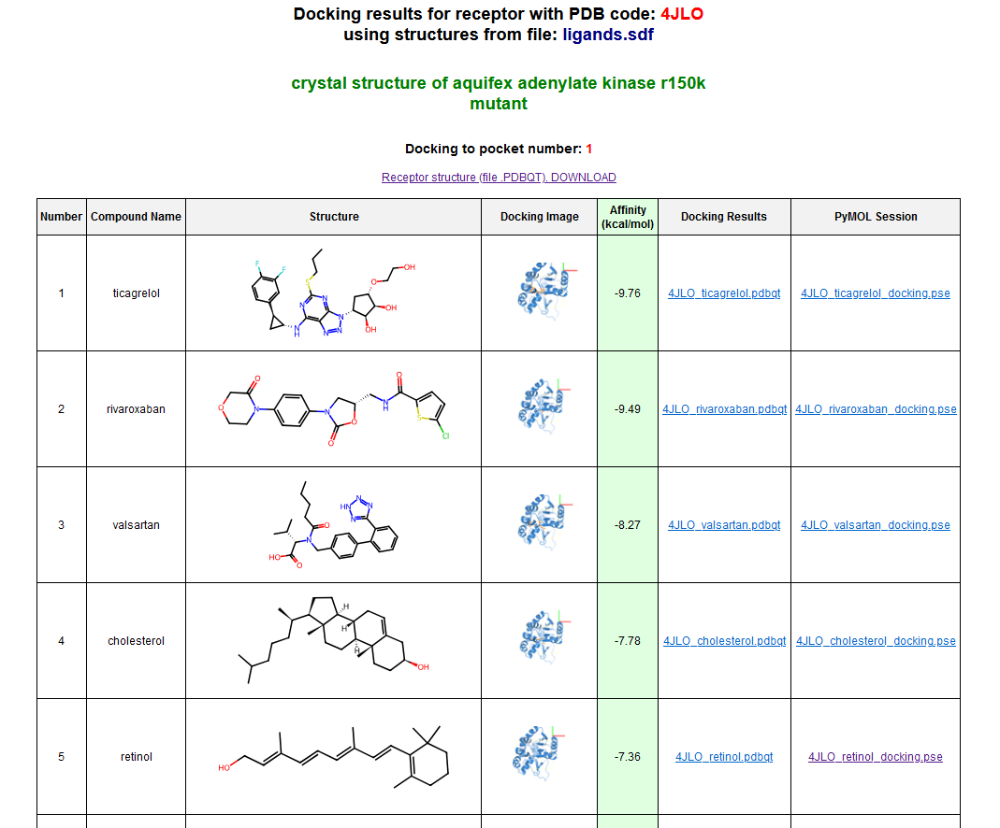
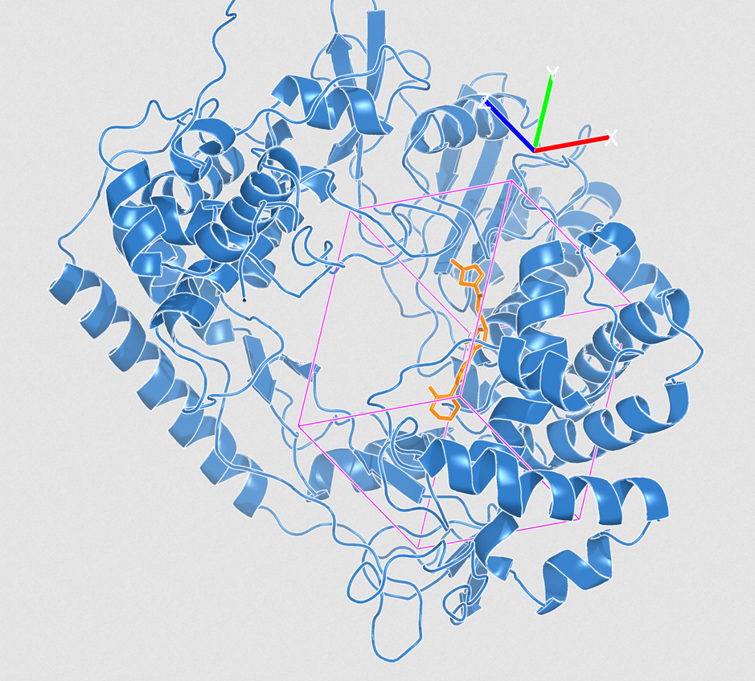
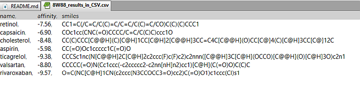

```markdown
# AutoDock Vina Pipeline with P2RANK for HTS Docking with WEB Interface

## Description

This repository provides an automated docking solution for ligands and receptor proteins using **AutoDock Vina** and **P2Rank**. It supports high-throughput docking workflows and integrates seamlessly with **SLURM**, a workload manager for distributed computing and queue management. Additionally, the entire functionality is built into a web interface using the **Streamlit** framework, allowing convenient and intuitive operation from a web browser.

The program is built on open-source libraries and solutions. It implements a user account system, facilitating easy project management, handling of generated data, and seamless navigation. The installation process is comprehensive, enabling even beginner users to utilize this tool effectively. The system is developed and tested on **Ubuntu 22.04** as a compute hosting server. Access via a web browser is unrestricted by the system, allowing the program to run locally on an Ubuntu machine or be configured as a server on a local network, accessible from any computer within the same LAN.

## Output Example

In this repository, there is a downloadable file [output_example.zip](https://github.com/Prospero1988/AutoDock_vina_pipeline/raw/refs/heads/main/output_example.zip) which contains an archive with a zipped sample output for the docking program.

## Results Screenshots
</br>
<div align="center">
    
</div>
</br>
<div align="center">
    
</div>
</br>
<div align="center">
    
</div>
</br>
<hr>

## Technologies Used

- **Python 3.11**: Core scripting language.
- **AutoDock Vina v1.2.5**: Molecular docking engine.
- **P2Rank v2.4.2**: Binding site prediction.
- **Biopython**, **RDKit**, **Open Babel**, **open-PyMOL**: Molecular handling, visualization, and preparation tools.
- **SLURM**: Workload manager for distributed computing and queue management.
- **Streamlit 1.40.2**: Frontend web interface.

## Requirements

- **Operating System**: Ubuntu 22.04 (or other compatible Debian distributions). For advanced users, any Linux distribution can be used, but library and installation package adjustments may be necessary.
  
### Python Libraries

- `biopython`
- `biopandas`
- `pandas`
- `pubchempy`
- `tqdm`
- `matplotlib`
- `scipy`
- `rdkit`
- `pdbfixer`
- `pymol-open-source`
- `streamlit`
- `bcrypt`

- **Java Runtime Environment (JRE)**

## Installation

The installation process is divided into several main stages. The program is configured to operate under a specific user account and name. If you wish to modify this, locate all instances of `docking_machine` in the `dock_GUI.py` file and replace them with your desired username. The docking server will be set up on this account.

### 1. Create a User Account for Docking

Create a user account named `docking_machine` and assign the necessary administrative permissions to install required packages and libraries. These permissions can be revoked after installation.

```bash
sudo adduser docking_machine
sudo usermod -aG sudo docking_machine
```

Log into the new user account:

```bash
su - docking_machine
```

*Alternatively, relog into this account by opening a new terminal session if you are working via SSH.*

### 2. Clone the Repository

Clone the repository and move it to the preferred directory, e.g., `/home/docking_machine/dock`:

```bash
git clone https://github.com/Prospero1988/AutoDock_vina_pipeline.git
mkdir ~/dock
mv ~/AutoDock_vina_pipeline/* ~/dock/
mv ~/AutoDock_vina_pipeline/.* ~/dock/ 2>/dev/null
rmdir ~/AutoDock_vina_pipeline
```

*Alternatively, you can perform these steps manually using your operating system's graphical interface.*

Set access permissions for the `dock` directory:

```bash
chmod -R 755 /home/docking_machine/dock
sudo chown -R docking_machine:docking_machine /home/docking_machine/dock
```

### 3. Install Dependencies and Configure

Navigate to the installation directory and run the installation script. **Do not** start this script with `sudo` to ensure that all packages and libraries are installed under the `docking_machine` user account, not the root account.

```bash
cd /home/docking_machine/dock/installation
chmod +x install.sh
./install.sh
```

At this stage, you can already work with the program via the command line by running the `init_docking.py` Python script. However, this method is not very convenient and does not support the workload manager or the graphical interface/server setup.

### 4. Install and Configure SLURM for Task Management

Ensure the system is up to date:

```bash
sudo apt update && sudo apt upgrade -y
```

Install the required dependencies:

```bash
sudo apt install -y munge libmunge-dev libmunge2 build-essential slurm-wlm slurm-client
```

Create an authentication key for Munge:

```bash
sudo /usr/sbin/create-munge-key
```

Set appropriate permissions:

```bash
sudo chown -R munge: /etc/munge /var/lib/munge /var/log/munge
sudo chmod 700 /etc/munge /var/lib/munge /var/log/munge
```

Start and enable the Munge service:

```bash
sudo systemctl enable munge
sudo systemctl start munge
```

Verify Munge is working correctly:

```bash
munge -n | unmunge
```

*Expected output: Success (0).*

Add a dedicated user for SLURM:

```bash
sudo useradd -r -m -d /var/lib/slurm -s /bin/false slurm
```

Create necessary directories:

```bash
sudo mkdir -p /var/spool/slurmd /var/log/slurm
```

Set appropriate permissions:

```bash
sudo chown -R slurm: /var/spool/slurmd /var/log/slurm
sudo chmod -R 755 /var/spool/slurmd /var/log/slurm
```

Check the hostname:

```bash
hostname
```

Edit the SLURM configuration file:

```bash
sudo nano /etc/slurm/slurm.conf
```

Add the following minimal configuration, replacing `<YOUR_CLUSTER_NAME>` with your preferred cluster name and `<YOUR_HOSTNAME>` with the hostname obtained earlier:

```conf
# Basic Configuration
ClusterName=<YOUR_CLUSTER_NAME>
ControlMachine=<YOUR_HOSTNAME>

# Ports and Authentication
SlurmctldPort=6817
SlurmdPort=6818
AuthType=auth/munge

# Logging
SlurmdLogFile=/var/log/slurm/slurmd.log
SlurmctldLogFile=/var/log/slurm/slurmctld.log

# Resource Management
SlurmUser=slurm
StateSaveLocation=/var/spool/slurmd
SlurmdSpoolDir=/var/spool/slurmd
ProctrackType=proctrack/pgid
TaskPlugin=task/none
SchedulerType=sched/backfill

# Node Configuration
NodeName=localhost CPUs=16 RealMemory=64000 State=UNKNOWN

# Partition Configuration
PartitionName=main Nodes=ALL Default=YES MaxTime=INFINITE State=UP
```

Save the file and set appropriate permissions:

```bash
sudo chown slurm: /etc/slurm/slurm.conf
sudo chmod 644 /etc/slurm/slurm.conf
```

Start and enable SLURM services:

```bash
sudo systemctl enable slurmctld
sudo systemctl enable slurmd
sudo systemctl start slurmctld
sudo systemctl start slurmd
```

Check the status of SLURM services:

```bash
sudo systemctl status slurmctld
sudo systemctl status slurmd
```

*Expected output: Active: active (running).*

Ensure all services start automatically on boot:

```bash
sudo systemctl enable munge
sudo systemctl enable slurmctld
sudo systemctl enable slurmd
```

### 5. Configure the Server as a System Service

To ensure the server is always available after a system restart, configure it as a system service using **systemd**.

Create a `streamlit_docking.service` file in the `/etc/systemd/system` directory:

```bash
sudo nano /etc/systemd/system/streamlit_docking.service
```

Add the following configuration, replacing paths as necessary:

```ini
[Unit]
Description=Streamlit Docking GUI Service
After=network.target

[Service]
User=docking_machine
Group=docking_machine
WorkingDirectory=/home/docking_machine/dock
Environment="PATH=/home/docking_machine/miniconda/envs/auto_dock/bin"
ExecStart=/home/docking_machine/miniconda/envs/auto_dock/bin/streamlit run dock_GUI.py
Restart=always
RestartSec=5

[Install]
WantedBy=multi-user.target
```

Set the correct permissions and ownership:

```bash
sudo chown root:root /etc/systemd/system/streamlit_docking.service
sudo chmod 644 /etc/systemd/system/streamlit_docking.service
```

Enable and start the service:

```bash
sudo systemctl daemon-reload
sudo systemctl enable streamlit_docking.service
sudo systemctl start streamlit_docking.service
```

Verify the service status:

```bash
sudo systemctl status streamlit_docking.service
```

*Expected output:*
```
‚óè streamlit_docking.service - Streamlit Docking GUI Service
     Loaded: loaded (/etc/systemd/system/streamlit_docking.service; enabled; vendor preset: enabled)
     Active: active (running) since ...
```

Open the necessary ports in the firewall:

```bash
sudo ufw allow 8001,8501
sudo ufw status
```

Test the setup after a system restart:

```bash
sudo reboot
```

After rebooting, verify the service is running:

```bash
sudo systemctl status streamlit_docking.service
```

Access the application via a web browser at:

```
http://<YOUR_COMPUTER_IP>:8501
```

### 6. NGINX Reverse Proxy Setup for Streamlit

To access the Streamlit application using the address `http://<YOUR_LAN_IP>` without specifying a port, you need to configure a reverse proxy using a web server like **NGINX**. The reverse proxy will handle requests on the default HTTP port (80) and forward them to Streamlit on port 8501.

#### Instructions for NGINX

##### 1. Install NGINX (if not already installed)

```bash
sudo apt update
sudo apt install nginx
```

##### 2. Configure NGINX as a Reverse Proxy

Create a configuration file for your Streamlit application:

```bash
sudo nano /etc/nginx/sites-available/streamlit
```

Insert the following configuration, replacing `<YOUR_LAN_IP>` with your actual LAN IP address:

```nginx
server {
    listen 80;
    server_name <YOUR_LAN_IP>;

    location / {
        proxy_pass http://127.0.0.1:8501;  # Forward requests to Streamlit
        proxy_set_header Host $host;
        proxy_set_header X-Real-IP $remote_addr;
        proxy_set_header X-Forwarded-For $proxy_add_x_forwarded_for;
        proxy_set_header X-Forwarded-Proto $scheme;

        # Handle WebSocket connections (required for Streamlit)
        proxy_http_version 1.1;
        proxy_set_header Upgrade $http_upgrade;
        proxy_set_header Connection "upgrade";
    }
}
```

##### 3. Enable the Configuration

Create a symbolic link to the `sites-enabled` directory:

```bash
sudo ln -s /etc/nginx/sites-available/streamlit /etc/nginx/sites-enabled/
```

##### 4. Remove Default Configuration (Optional)

If the default NGINX configuration is not needed, remove it:

```bash
sudo rm /etc/nginx/sites-enabled/default
```

##### 5. Test Configuration and Restart NGINX

Test the NGINX configuration to ensure there are no errors:

```bash
sudo nginx -t
```

If everything is correct, restart NGINX:

```bash
sudo systemctl restart nginx
```

##### 6. Test Access

Open your browser and navigate to:

```
http://<YOUR_LAN_IP>
```

#### NGINX as a System Service

NGINX is designed as a system service that automatically starts during system boot. By default, after installation, NGINX is configured to start automatically. However, you can verify or manually enable this option.

##### Check NGINX Status

Run the following command to ensure NGINX is enabled and starts on boot:

```bash
sudo systemctl is-enabled nginx
```

The expected output is:

```
enabled
```

##### Enable NGINX at Startup (If Not Enabled)

If the previous command returns `disabled`, you can enable NGINX:

```bash
sudo systemctl enable nginx
```

##### Verify NGINX is Running

Check if NGINX is active:

```bash
sudo systemctl status nginx
```

If everything is fine, you should see a message similar to:

```
‚óè nginx.service - A high performance web server and a reverse proxy server
     Loaded: loaded (/lib/systemd/system/nginx.service; enabled; vendor preset: enabled)
     Active: active (running) since ...
```

#### Summary

By configuring NGINX as a service and enabling it, it will run automatically at every system boot without needing manual intervention. If your Streamlit server is properly running through NGINX, accessing the application via `http://<YOUR_LAN_IP>` will consistently work after each restart. 🚀
```
