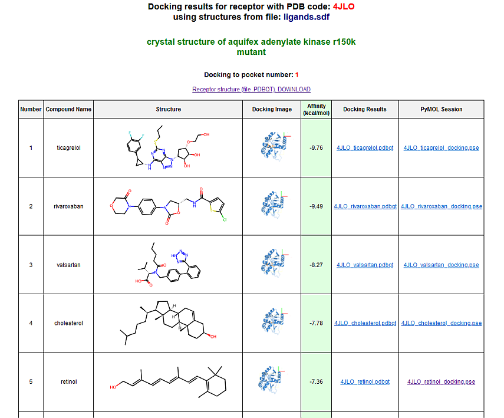

# AutoDock Vina Pipeline with P2RANK for HTS Docking

This repository provides an automated docking solution for ligands and receptor proteins using AutoDock Vina and P2Rank. It supports high-throughput docking workflows and integrates seamlessly with SLURM or can be run locally.

# Disclaimer

I am still working on this project and adding new features. The uploaded repository is fully functional. If you have any suggestions then feel free to contact me, or open a discussion or add a post.

## Problems and support

If you have any problems with the installation or operation of the docking program do not be shy and contact me. I will try my best to help you.

## Output example

In this repository there is a downloadable file [output_example.zip](https://github.com/Prospero1988/AutoDock_vina_pipeline/raw/refs/heads/main/output_example.zip) which contains an archive with a zipped sample output for the docking program.

## Results screenshots





## Technologies Used
- **Python 3.11**: Core scripting language.
- **AutoDock Vina v1.2.5**: Molecular docking engine.
- **P2Rank v2.4.2**: Binding site prediction.
- **Biopython, RDKit, Open Babel, PyMOL**: Molecular handling, visualization, and preparation tools.
- **SLURM**: Workload manager for distributed computing (optional).

## Requirements
- **Ubuntu 22.04**
- **Miniconda** (Installed via provided scripts)
- **SLURM** (Optional for distributed execution)

### Python Libraries
- `biopython`, `biopandas`, `pubchempy`, `tqdm`, `matplotlib`, `scipy`, `rdkit`, `pdbfixer`, `pymol-open-source`

### System Tools
- `openbabel`, `wget`, `tar`
- **Java Runtime Environment (JRE)**

## Docking Workflow

The `init_docking.py` script automates the process of docking multiple ligands to multiple receptor proteins. It is designed to handle all necessary steps, from input preparation to generating docking results, with minimal user intervention. Below is a detailed breakdown of its workflow:

---

### **1. Input Parsing**
- The script accepts the following arguments:
  - `--pdb_ids`: A CSV file located in the `./receptors` directory, containing the PDB IDs of receptor proteins. Each ID corresponds to a unique protein structure available in the Protein Data Bank (PDB).
  - `--ligands`: A ligand file located in the `./ligands` directory. Supported formats include **SDF** and **MOL2** files, allowing flexibility in ligand input.
  - Optional parameters like `--tol_x`, `--tol_y`, `--tol_z`, `--pckt`, `--exhaust`, and `--energy_range` define the docking box dimensions, pocket selection, search thoroughness, and energy range for pose scoring.

- **Automatic Ligand Naming**:
  - In cases where ligands in the input files lack explicit names, the script assigns them generic names in the format `ligand_001`, `ligand_002`, etc., ensuring consistent and organized output.

---

### **2. Receptor Preparation**
- **Download Receptor Structures**:
  - For each PDB ID listed in the CSV file, the script downloads the corresponding protein structure from the [Protein Data Bank (PDB)](https://www.rcsb.org/).
  - The downloaded file is saved as `<PDB_ID>_dirty.pdb` in a newly created folder named after the receptor (e.g., `./8W88/`).

- **Fixing the Receptor**:
  - Using `PDBFixer`, the script:
    - Retains only the chain with the maximum number of residues.
    - Removes heteroatoms and water molecules.
    - Adds missing residues, atoms, and hydrogens based on a physiological pH of 7.4.
  - The fixed structure is saved as `<PDB_ID>_fixed.pdb`.

- **Receptor Conversion**:
  - The fixed PDB structure is converted to the `.pdbqt` format required by AutoDock Vina. The converted file is saved as `<PDB_ID>.pdbqt`.

---

### **3. Binding Site Prediction**
- The script utilizes [P2Rank](https://github.com/rdk/p2rank) to predict potential binding sites (pockets) on the receptor.
  - The predictions are saved in a folder named `01_p2rank_output` within the receptor's directory.
  - A CSV file (`<PDB_ID>_predictions.csv`) lists each pocket's coordinates, size, and scores.

- The selected pocket (based on the `--pckt` argument) is used to define the docking box dimensions. This includes the center coordinates (`center_x`, `center_y`, `center_z`) and sizes (`size_x`, `size_y`, `size_z`) with optional tolerances (`--tol_x`, `--tol_y`, `--tol_z`) for each axis.

---

### **4. Ligand Preparation**
- For each ligand in the provided SDF or MOL2 file:
  - **Format Handling**:
    - The script automatically detects the file format (SDF or MOL2) and processes accordingly.
  
  - **Conversion and Processing**:
    - The ligand is converted to `.pdb` format using RDKit.
    - Hydrogen atoms are added, and a 3D conformer is generated for the ligand.
    - The `.pdb` file is converted to `.pdbqt` format required for docking using Open Babel.

- **Output Organization**:
  - The prepared ligand files are stored in the `02_ligands_results` subdirectory within the receptor's folder (e.g., `./8W88/02_ligands_results/`).

---

### **5. Docking Execution**
- The script runs AutoDock Vina for each receptor-ligand pair:
  - The docking box is defined using P2Rank predictions.
  - Parameters such as `--exhaust` (exhaustiveness) and `--energy_range` control the thoroughness and energy tolerance for pose scoring.
  - Docking results are saved in `.pdbqt` format, and key details (e.g., binding affinities) are extracted from the output.

- **Post-Docking File Management**:
  - All `.pdbqt` files for ligands after docking are collectively copied into the `03_ligands_PDBQT` folder, facilitating easy access without navigating through individual folders.

---

### **6. Visualization and Results Generation**
- **Visualizations**:
  - PyMOL is used to generate visualizations of the best-docked ligand poses superimposed on the receptor structure.
    - The visualizations now include the docking grid (box) and XYZ axes for better spatial orientation.
    - Both high-resolution images (`.png`) and PyMOL session files (`.pse`) are saved for each docking result.
    - The PyMOL session files include the docking grid and XYZ axes, allowing users to explore the docking results interactively within PyMOL.

- **HTML and CSV Reports**:
  - **HTML Report**:
    - The script creates an interactive HTML report for each receptor, summarizing:
      - Key docking metrics (binding energies, pocket scores).
      - Links to output files (e.g., `.pdbqt` and `.txt`).
      - 2D and 3D visualizations of ligand-receptor complexes.
      - **New**: An additional column with links to the PyMOL session files (`.pse`), enabling users to open and manipulate the docking results directly in PyMOL.

  - **CSV Summary**:
    - In addition to the HTML report, a CSV summary file is generated containing:
      - **Name**: Ligand name.
      - **Affinity**: Binding affinity values.
      - **SMILES**: Simplified molecular-input line-entry system representations of ligands.
    - This CSV file provides a convenient overview of docking results for further analysis.

---

### **7. Outputs**
- Each receptor has its dedicated directory containing:

  - **Processed Structures**:
    - `<PDB_ID>_dirty.pdb`: Raw receptor structure.
    - `<PDB_ID>_fixed.pdb`: Cleaned receptor structure.
    - `<PDB_ID>.pdbqt`: Receptor ready for docking.

  - **Docking Results**:
    - `02_ligands_results/`:
      - `<ligand_name>.pdbqt`: Prepared ligand.
      - `<ligand_name>.svg`: 2D ligand structure images.
      - `<PDB_ID>_<ligand_name>_docking.pse`: PyMOL session files including the docking grid and XYZ axes.
    - `03_ligands_PDBQT/`:
      - All docked ligand `.pdbqt` files copied here for easy access.

  - **Visualizations**:
    - `<PDB_ID>_<ligand_name>_docking.png`: High-resolution 3D visualizations of docked complexes.

  - **Reports**:
    - `<PDB_ID>_results.html`: Interactive HTML report summarizing docking results, including links to PyMOL session files.
    - `<PDB_ID>_results_in_CSV.csv`: CSV file containing ligand name, affinity, and SMILES.

  - **P2Rank Predictions**:
    - `01_p2rank_output/<PDB_ID>_predictions.csv`: Binding site information.

---

This modular pipeline ensures seamless handling of multiple receptors and ligands, providing users with comprehensive results for further analysis.

## Installation

### Full Installation (Fresh System)
1. Clone the repository:
    ```bash
    git clone https://github.com/your-repository/docking-system.git
    cd docking-system
    ```
2. Run the installation script:
    ```bash
    chmod +x install.sh
    bash install.sh
    ```

### Minimal Installation (Configured System)
For environments where most dependencies are already configured:
```bash
chmod +x mini_install.sh
bash mini_install.sh
```

### Additional Configuration
Ensure the following tools are available in their respective paths:
- **AutoDock Vina**: `/usr/local/bin/vina_1.2.5_linux_x86_64`
- **P2Rank**: `/usr/local/bin/prank`

## Usage

### SLURM Execution
1. **Prepare Input Files**:
   - Place receptor PDB IDs in a CSV file under `./receptors`.
   - Place ligand structures in **SDF** or **MOL2** format under `./ligands`.

2. **Submit the Job via SLURM**:
    ```bash
    sbatch start_docking.sh
    ```

### Local Execution
1. **Activate the Conda Environment**:
    ```bash
    source ~/miniconda3/etc/profile.d/conda.sh
    conda activate auto_dock
    ```
2. **Run the Python Script**:
    ```bash
    python3 init_docking.py --pdb_ids receptors.csv --ligands ligand_file.sdf --tol_x 5 --tol_y 5 --tol_z 5
    ```
   - To use a MOL2 file:
    ```bash
    python3 init_docking.py --pdb_ids receptors.csv --ligands ligand_file.mol2 --tol_x 5 --tol_y 5 --tol_z 5
    ```

- **Note**: The `--tol_x`, `--tol_y`, and `--tol_z` arguments allow independent control over the expansion of the docking box along the X, Y, and Z axes, respectively.

## SLURM Configuration
The repository includes a sample SLURM script (`start_docking.sh`) optimized for the docking pipeline. Key configurations include:
- Single task allocation (`#SBATCH --ntasks=1`).
- Infinite runtime (`#SBATCH --time=INFINITE`).

## Input Parameters
- `--pdb_ids`: CSV file with receptor PDB codes.
- `--ligands`: SDF or MOL2 file containing ligands.
- `--tol_x`, `--tol_y`, `--tol_z`: Docking box tolerances in Ångströms to expand the docking pocket dimensions along the X, Y, and Z axes respectively (default: 0 for each).
- `--pckt`: Pocket number from P2Rank predictions (default: 1).
- `--exhaust`: Docking thoroughness (default: 20).
- `--energy_range`: Energy range for docking poses (default: 2 kcal/mol).

## Outputs
1. **Results Organized by Receptor**:
   - `02_ligands_results/`:
     - `<ligand_name>.pdbqt`: Prepared ligand.
     - `<ligand_name>.svg`: 2D ligand structure.
     - `<PDB_ID>_<ligand_name>_docking.pse`: PyMOL session files including the docking grid and XYZ axes.
   - `03_ligands_PDBQT/`:
     - All docked ligand `.pdbqt` files copied here.
   
2. **Reports**:
   - `<PDB_ID>_results.html`: Summarized docking results with interactive visualizations and links to PyMOL session files.
   - `<PDB_ID>_results_in_CSV.csv`: CSV file containing ligand name, affinity, and SMILES.

3. **Visualizations**:
   - `<PDB_ID>_<ligand_name>_docking.png`: High-resolution 3D visualizations of docked complexes.

## Notes
- The system works best with SLURM for distributed execution but can run locally.
- Ensure all dependencies are correctly installed and configured.
- The visualizations now include the docking grid and XYZ axes for improved spatial orientation.
- PyMOL session files are provided for interactive exploration of docking results.
- The single `--tol` argument has been replaced with three independent arguments `--tol_x`, `--tol_y`, and `--tol_z` for finer control over the docking box dimensions.
- Follow the user manual (`User_Guide_Docking_System_ENG.html`) for detailed steps.

For more details, refer to the [Installation Guide](manuals/Installation_Guide_ENG.html).

# Acknowledgments

- [AutoDock Vina](http://vina.scripps.edu/)
- [P2Rank](https://github.com/rdk/p2rank)
- [RDKit](https://www.rdkit.org/)
- [Open Babel](https://openbabel.org/)
- [PyMOL](https://pymol.org/)

---

*This README was generated and updated with the assistance of ChatGPT.*

---
